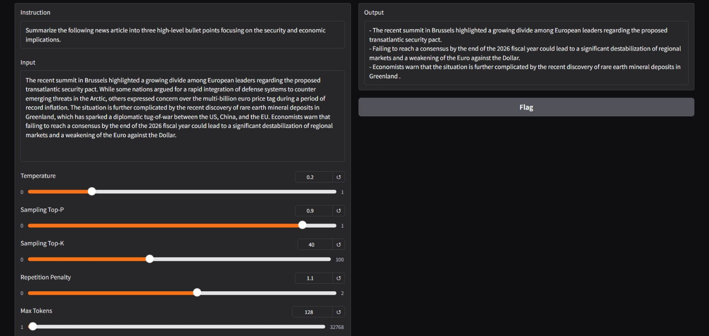
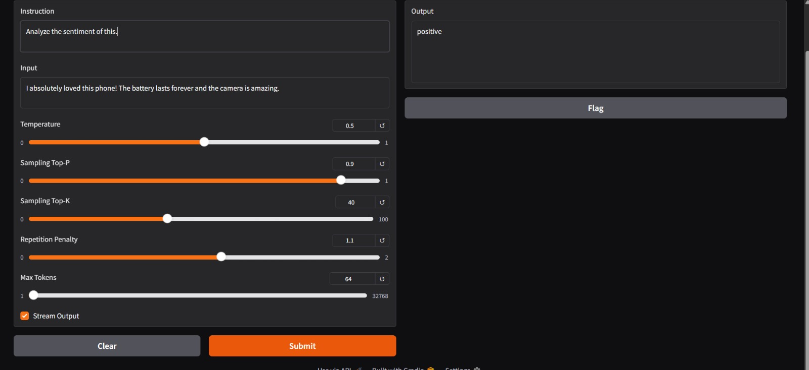

<p align="center">
  <h1 align="center">🔀 Mix-LoRA: LoRA Mixing & Fine-Tuning Playground</h1>
  <p align="center">
    <em>Blend multiple low-rank adaptation (LoRA) layers trained on different tasks into a single multi-skilled model — with minimal compute.</em>
  </p>
</p>

<p align="center">
  <a href="#-quick-start">Quick Start</a> •
  <a href="#-playground-demo">Playground</a> •
  <a href="#-project-structure">Structure</a> •
  <a href="#-how-it-works">How It Works</a> •
  <a href="#-license">License</a>
</p>

---

## 📖 Overview

**Mix-LoRA** implements the *MixLoRA* concept — a Mixture-of-Experts (MoE) approach to Parameter-Efficient Fine-Tuning (PEFT). Instead of training one monolithic model for every task, you train small, lightweight **LoRA expert adapters** on individual tasks (e.g., sentiment analysis, text summarization) and then **mix them together** through learned routing into a single adapter. The result is a multi-talented model achieved with a fraction of the compute of full fine-tuning.

### Why Mix-LoRA?

| Benefit | Description |
|---|---|
| **Minimal Compute** | Each LoRA adapter adds < 1 % of the base model's parameters. Mixing them is nearly free. |
| **Powerful Model Reuse** | One frozen base model serves many tasks simultaneously via swappable/mixed adapters. |
| **Modular & Composable** | Train adapters independently, then compose them — like building blocks. |
| **Easy Experimentation** | The Gradio playground lets you test any instruction interactively, adjusting generation parameters in real time. |

---

## 🧠 Base Model

This project uses **[TinyLlama 1.1B Chat v1.0](https://huggingface.co/TinyLlama/TinyLlama-1.1B-Chat-v1.0)** as the frozen base model.

| Property | Value |
|---|---|
| **Name** | TinyLlama-1.1B-Chat-v1.0 |
| **Parameters** | 1.1 Billion |
| **Architecture** | LLaMA-style Transformer |
| **Context Length** | 2 048 tokens |
| **Training Data** | ~3 T tokens (SlimPajama + StarCoder) |
| **License** | Apache 2.0 |

TinyLlama is chosen because it is small enough to run on consumer hardware (even CPU-only), yet capable enough to demonstrate multi-task mixing clearly.

---

## 🔧 Adapter Configuration (MixLoRA)

The pre-trained multi-task adapter is located in `multi_task_0/`. Its configuration:

| Parameter | Value |
|---|---|
| PEFT Type | `MIXLORA` |
| Rank (`r`) | 16 |
| Alpha (`lora_alpha`) | 32 |
| Dropout | 0.05 |
| Routing Strategy | `mixlora` |
| Number of Experts | 8 |
| Top-K Experts | 2 |
| Activation | SiLU |
| Target Modules | `q_proj`, `k_proj`, `v_proj`, `o_proj`, `gate_proj`, `down_proj`, `up_proj` |

The adapter applies LoRA decomposition to **all attention and feed-forward projection layers**, with 8 expert branches and a learned router selecting the top-2 experts per token — enabling different experts to specialise on different tasks.

---

## 🚀 Quick Start

### Prerequisites

- **Python** 3.8 or higher
- **Git** & **Git LFS**
- A machine with at least **8 GB RAM** (GPU optional; CPU works for inference)

### Step-by-Step Setup

**1. Clone the repository**

```bash
git clone https://github.com/uk00007/Mix-LoRA.git
```

**2. Enter the project directory**

```bash
cd Mix-LoRA
```

**3. Install dependencies**

```bash
pip install -r requirements.txt
```

**4. Launch the Gradio Playground**

```bash
python inference.py 
  --base_model TinyLlama/TinyLlama-1.1B-Chat-v1.0 
  --lora_weights ./multi_task_0 
  --template alpaca
```

The server starts on `http://127.0.0.1:7860/`. Open that URL in your browser to interact with the playground.

> **Tip:** Add `--share_gradio` to create a public Gradio link you can share with anyone.

### Optional flags

| Flag | Description |
|---|---|
| `--load_16bit` | Load model in BF16 half-precision (default: **True**) |
| `--load_8bit` | Load model with 8-bit quantization |
| `--load_4bit` | Load model with 4-bit quantization |
| `--flash_attn` | Use Flash Attention 2 (NVIDIA Ampere+ GPUs) |
| `--device <name>` | Force a specific device (e.g., `cpu`, `cuda:0`, `mps`) |
| `--share_gradio` | Generate a public shareable URL |

---

## 🎮 Playground Demo

The interactive **Gradio** web UI lets you type any instruction + input, tune generation parameters, and see the model's output in real time.

### Summarization Task

> **Instruction:** *"Summarize the following news article into three high-level bullet points focusing on the security and economic implications."*



### Sentiment Analysis Task

> **Instruction:** *"Analyze the sentiment of this."*



**Generation controls available in the playground:**

| Control | Range | Default |
|---|---|---|
| Temperature | 0 – 1 | 0.2 – 0.5 |
| Sampling Top-P | 0 – 1 | 0.9 |
| Sampling Top-K | 0 – 100 | 40 |
| Repetition Penalty | 0 – 2 | 1.1 |
| Max Tokens | 1 – 32 768 | 64 – 128 |
| Stream Output | on / off | on |

---

## 📂 Project Structure

```
Mix-LoRA/
├── inference.py              # 🎮 Gradio playground — run this to interact with the model
├── moe_peft.py               # Core training / evaluation / inference CLI
├── launch.py                 # Helper to generate configs & launch training runs
├── evaluator.py              # Evaluation entry point
├── generate.py               # Standalone generation script
│
├── multi_task_0/             # Pre-trained MixLoRA adapter (sentiment + summarization)
│   ├── adapter_config.json
│   └── multi_task_0_1000/
│       └── adapter_config.json
│
├── template/
│   └── alpaca.json           # Alpaca prompt template (instruction / input / response)
│
├── templates/                # Training configuration templates
│   ├── lora.json             #   Standard LoRA
│   ├── mixlora.json          #   MixLoRA (MoE routing)
│   ├── loramoe.json          #   LoRAMoE variant
│   ├── mola.json             #   MoLA variant
│   └── *_glm.json / *_phi.json / *_phi3.json   # Model-specific variants
│
├── moe_peft/                 # 📦 Core library package
│   ├── __init__.py
│   ├── model.py              # LLMModel — loads base model + adapters
│   ├── trainer.py            # Training loop
│   ├── evaluator.py          # Evaluation logic
│   ├── generator.py          # Text generation logic
│   ├── dispatcher.py         # Task dispatcher for multi-adapter training
│   ├── tokenizer.py          # Tokenizer wrapper
│   ├── prompter.py           # Prompt formatting
│   ├── utils.py              # Utilities
│   │
│   ├── adapters/             # MoE adapter implementations
│   │   ├── mixlora/          #   MixLoRA — MoE routing with LoRA experts
│   │   ├── loramoe/          #   LoRAMoE variant
│   │   └── mola/             #   MoLA variant
│   │
│   ├── common/               # Shared components
│   │   ├── lora_linear.py    #   LoRA linear layer implementation
│   │   ├── attention.py      #   Attention mechanisms
│   │   ├── feed_forward.py   #   Feed-forward layers
│   │   ├── moe_utils.py      #   MoE routing utilities
│   │   ├── rope.py           #   Rotary positional embeddings
│   │   ├── config.py         #   Configuration classes
│   │   ├── checkpoint.py     #   Checkpoint save / load
│   │   └── cache.py          #   KV cache
│   │
│   ├── executors/            # Hardware-specific backends
│   │   ├── cuda.py           #   NVIDIA GPU
│   │   ├── mps.py            #   Apple Silicon
│   │   └── cpu.py            #   CPU fallback
│   │
│   ├── models/               # Model architecture implementations
│   │   ├── modeling_llama.py  #   LLaMA / TinyLlama
│   │   ├── modeling_mistral.py
│   │   ├── modeling_phi.py
│   │   ├── modeling_phi3.py
│   │   ├── modeling_gemma.py
│   │   ├── modeling_gemma2.py
│   │   └── modeling_chatglm.py
│   │
│   └── tasks/                # Task definitions (GLUE, QA, etc.)
│       ├── common.py
│       ├── glue_tasks.py
│       └── qa_tasks.py
│
├── tests/                    # Test suite
│   ├── dummy_data.json
│   ├── dummy_train.py
│   ├── dummy_train_mixlora.py
│   ├── mixlora_generation.py
│   ├── peft_generation.py
│   └── test_demo.py
│
├── prompts/                  # Prompt configuration files
├── misc/                     # Notebooks, scripts, evaluation helpers
├── assets/                   # Screenshots and images
├── requirements.txt          # Python dependencies
├── pyproject.toml            # Package metadata
├── Dockerfile                # Container build file
├── Install.md                # Detailed installation guide
└── LICENSE                   # Apache 2.0
```

---

## ⚙️ How It Works

```
┌─────────────────────────────────────────────────────┐
│                  Frozen Base Model                   │
│            TinyLlama 1.1B Chat v1.0                 │
│                                                     │
│   ┌──────────┐  ┌──────────┐       ┌──────────┐    │
│   │ Expert 1 │  │ Expert 2 │  ...  │ Expert 8 │    │
│   │ (LoRA)   │  │ (LoRA)   │       │ (LoRA)   │    │
│   └────┬─────┘  └────┬─────┘       └────┬─────┘    │
│        │              │                  │          │
│        └──────────┬───┘──────────────────┘          │
│                   │                                 │
│           ┌───────▼────────┐                        │
│           │  Gating Router │  (selects top-2)       │
│           │   per token    │                        │
│           └───────┬────────┘                        │
│                   │                                 │
│           ┌───────▼────────┐                        │
│           │ Weighted Mix   │                        │
│           └───────┬────────┘                        │
│                   ▼                                 │
│             Final Output                            │
└─────────────────────────────────────────────────────┘
```

1. **Base model stays frozen** — no full fine-tuning is needed.
2. **Each expert is a lightweight LoRA** (rank-16 low-rank matrices injected into attention & FFN layers).
3. **A learned gating router** scores all 8 experts for each token and selects the **top-2**.
4. The selected experts' outputs are **weighted and summed**, producing the final adapted representation.
5. Different tokens can route to different experts, allowing the model to **dynamically specialise** — e.g., routing summarization tokens to one expert set and sentiment tokens to another.

---

## 🧪 Supported PEFT Methods

| Method | Paper | Key Config |
|---|---|---|
| **MixLoRA** | [arXiv 2404.15159](https://arxiv.org/abs/2404.15159) | `"routing_strategy": "mixlora", "num_experts": 8` |
| **MoLA** | [arXiv 2402.08562](https://arxiv.org/abs/2402.08562) | `"routing_strategy": "mola", "num_experts": 8` |
| **LoRAMoE** | [arXiv 2312.09979](https://arxiv.org/abs/2312.09979) | `"routing_strategy": "loramoe", "num_experts": 8` |
| **LoRA** | [arXiv 2106.09685](https://arxiv.org/abs/2106.09685) | `"r": 8, "lora_alpha": 16, "lora_dropout": 0.05` |
| **DoRA** | [arXiv 2402.09353](https://arxiv.org/abs/2402.09353) | `"use_dora": true` |
| **rsLoRA** | [arXiv 2312.03732](https://arxiv.org/abs/2312.03732) | `"use_rslora": true` |
| **LoRA+** | [arXiv 2402.12354](https://arxiv.org/abs/2402.12354) | `"loraplus_lr_ratio": 20.0` |

---

## 🖥️ Supported Platforms

| OS | Executor | Precision | Quantization | Flash Attention |
|---|---|---|---|---|
| Linux | CUDA | FP32, FP16, TF32, BF16 | 8-bit / 4-bit | ✅ |
| Windows | CUDA | FP32, FP16, TF32, BF16 | 8-bit / 4-bit | — |
| macOS | MPS | FP32, FP16, BF16 | — | — |
| Any | CPU | FP32, FP16, BF16 | — | — |

---

## 📋 Dependencies

Key packages (see `requirements.txt` for the full list):

| Package | Version |
|---|---|
| `torch` | >= 2.4.0 |
| `transformers` | >= 4.44.0 |
| `peft` | 0.11.1 |
| `gradio` | latest |
| `datasets` | latest |
| `accelerate` | latest |
| `mixlora` | >= 0.2.2, < 0.3.0 |
| `sentencepiece` | latest |
| `fire` | latest |

---

## 🐳 Docker (Optional)

```bash
docker run --gpus all -it --rm mikecovlee/moe_peft
```

See all available tags at [Docker Hub](https://hub.docker.com/r/mikecovlee/moe_peft/tags).

---

## 📝 License

This project is licensed under the [Apache 2.0 License](./LICENSE).
